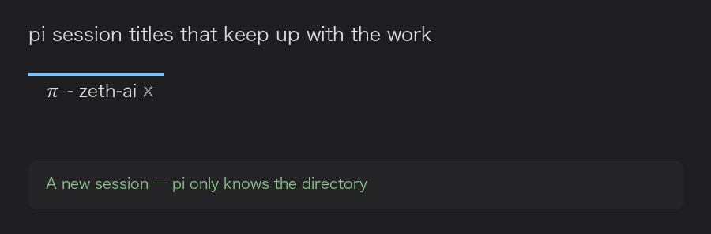
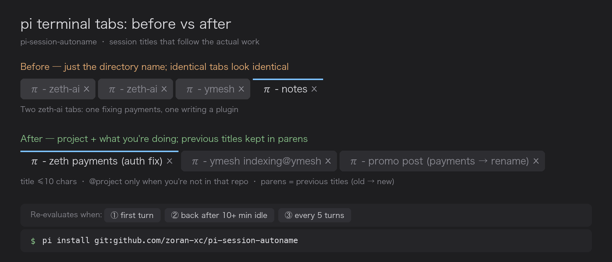

# pi-tab-title





[](https://github.com/zoran-xc/pi-tab-title/actions/workflows/test.yml)
[](LICENSE)


Session titles for [pi](https://pi.dev) that keep up with the work. A pi package, one file, no dependencies.

[English](README.md) · [中文](README.zh-CN.md)

> Renamed from `pi-session-autoname` in v0.3.0 (the npm name was taken by an unrelated package). The old GitHub URL redirects, and your config is migrated automatically.

## The problem

pi already lets you name a session (`/name`, `--name`, <kbd>Ctrl</kbd>+<kbd>R</kbd> in `/resume`) and mirrors
that name into the terminal window title. What it never does is keep the name *true*: you name a session
"payment fix", three topics later it is still "payment fix", and the tab bar fills up with
`π - zeth-ai` four times over. In practice nobody renames anything, so the tabs stop being useful.

## Install

```bash
pi install git:github.com/zoran-xc/pi-tab-title@v0.2.1
```

Or for local development, point pi at the checkout instead:

```bash
pi install /path/to/pi-tab-title
```

Restart pi. Runtime state lives in `~/.pi/agent/pi-tab-title/` — **not** inside the package, so
`pi update` never wipes your config:

| File | Purpose |
| --- | --- |
| `config.json` | Settings. Hot-read on every use, no restart needed |
| `naming-rules.md` | Your naming preferences, as a prompt (see below) |
| `autoname.log` | Every rename, the rendered terminal title, and errors (truncated past 256 KB) |

## What it does

- **Names the session the moment you send the first message**, then keeps it honest as the work drifts.
- **Re-evaluates on a cadence instead of on every turn** — see below.
- **Sends only conversation conclusions to the naming model**: user messages and assistant replies.
  Tool call arguments, tool output and thinking are never included, which keeps the request small and cheap.
- **Keeps previous titles in parentheses**, so renaming never loses "what was I doing before".
- **Marks `@project` only when you're talking about a repo other than your cwd** — no repeated noise
  when you *are* in the right directory.
- **Hard 10-character cap** on the title: an over-long attempt gets one self-compression retry, then a hard cut.
- **Refuses placeholder junk** (`未命名`, `none`, …) and never treats `changed=false` as gospel when the
  session has no title yet.

### Cadence

| When | What happens |
| --- | --- |
| You send the **first message** of a new session | Named immediately — before the agent even replies (waiting for `agent_settled` would stall behind a long first run) |
| You were away for more than `idleRenameAfterMs` (10 min by default) | Re-evaluated when that next turn settles |
| Continuous conversation | Re-evaluated every `updateEveryTurns` (5 by default) turns |

Idle time is measured from the previous turn's end to the next turn's **start**, so it reflects how long
*you* were away, not how long the agent spent working.

## Naming is a prompt, not a settings enum

This is the part that differs from most session-namers. Instead of exposing a `nameFormat` template and
an enum of types, the whole naming policy is a markdown file you write:

```markdown
- Same language as me
- ≤ 10 characters; drop the secondary details but never the project or the action
- Priority: project name > current action > context
- If I'm discussing a different repo than my cwd, fill the `project` field
- When the topic migrates, follow it — don't stay on the first thing we discussed
- Don't rename when the task hasn't changed. No pointless churn.
```

Preferences are exactly the thing that doesn't fit in an enum, so they live in a prompt. Edit
`~/.pi/agent/pi-tab-title/naming-rules.md` and it takes effect on the next evaluation.

## Terminal title template

The session name stays short; everything else is composed into the terminal title by a template
(default `π - {name}{project} {prev}`):

| Placeholder | Renders as |
| --- | --- |
| `{name}` | Current title |
| `{project}` | `@shortname` **only when the discussed project ≠ your cwd**, otherwise empty |
| `{prev}` | Previous titles, e.g. `(zeth auth fix → zeth payments)` |
| `{status}` | 进行中 / 待审核 / 已完成 / 阻塞 (not used by default — it reads as noise) |
| `{turns}` | Turns so far |

Empty placeholders get their separators and empty parens cleaned up, so `π - {name} {status}` never
degrades into `π - foo - `. Set `titleTemplate` to `""` to leave the terminal title entirely to pi.

> **VS Code:** the integrated terminal hides program-set titles by default. Set
> `"terminal.integrated.tabs.title": "${sequence}"`. Do *not* prefix it with `${process}` — that adds a
> pointless `node - ` to every tab.

## Configuration

`~/.pi/agent/pi-tab-title/config.json`, hot-read (no restart):

| Key | Default | Meaning |
| --- | --- | --- |
| `enabled` | `true` | Master switch |
| `model` | `""` | Naming model; empty = the current session's model. A cheap small model is fine |
| `maxChars` | `10` | Title character cap (every character counts as 1) |
| `rulesFile` | `naming-rules.md` | Your naming policy |
| `extraInstructions` | `""` | Appended to the system prompt |
| `updateEveryTurns` | `5` | Re-evaluation period in a continuous conversation |
| `idleRenameAfterMs` | `600000` | Come back after this much idle time → re-evaluate |
| `minMsBetweenUpdates` | `30000` | Minimum gap between two naming requests |
| `includeAssistant` | `true` | Feed assistant replies to the model as well |
| `perMessageChars` / `maxDigestChars` / `maxMessages` | `1200` / `6000` / `30` | Digest size limits |
| `titleTemplate` | `π - {name}{project} {prev}` | Terminal title template |
| `prevTitleCount` | `2` | How many previous titles `{prev}` shows |
| `includeGitBranch` | `true` | Put the current git branch into the model's context |
| `skipWhenNoUI` | `true` | Don't auto-name in `pi -p` (saves a request) |
| `debug` | `false` | UI notifications + full trace log |

### Commands

```
/autoname            # current title, status, cadence, title history
/autoname now        # re-evaluate immediately
/autoname on|off     # toggle for this session
/autoname config     # print the config path
/autoname rules      # print the naming rules path
```

Note: a manual `/name` does **not** disable the extension — your name is recorded as a previous title and
shows up in parens. Use `/autoname off` if you want to take over.

## How it compares

Full, fairness-checked version: **[docs/comparison.md](docs/comparison.md)** (all ten packages, what is *not* unique here, and a "picking one" table). Short version:


At least ten pi packages do some flavour of this; these are the closest, based on their own READMEs:

| Package | When it renames | How configurable | Terminal title |
| --- | --- | --- | --- |
| `pi-session-name` | First turn only, from the first input, then frozen | — | ✅ busy/idle prefix |
| `@nicknisi/pi-session-name` | First `agent_settled` | Heuristic or one-off LLM | ✅ |
| `@d3ara1n/pi-session-namer` | First turn (side agent, +0.5–1 s) | Zero-config by design | — |
| `pi-session-namer` | First turn + every 4 turns | Format template + type list + language | — |
| `pi-autoname` | First turn + 10-minute cooldown | Model / cooldown / respect manual name | — |
| `@oipsanthony/pi-session-title` | First turn + every 4 user turns | Model / period / `{title}{cwd}` template | ✅ templated |
| **pi-tab-title** | First turn + **>10 min idle** + every 5 turns | **Naming policy is a markdown prompt** | ✅ `{name}{project}{prev}` |

Being straight about it: periodic re-evaluation is not unique to this package — `pi-session-namer`,
`pi-autoname` and `@oipsanthony/pi-session-title` all re-check. The real differences are **what triggers**
it (this one measures how long *you* were away), **what gets kept** (previous titles in the tab), and
**how far you can bend it** (a prompt rather than knobs). It has **no** tmux/Herdr integration, no GUI,
and it expects you to write a naming policy rather than working zero-config out of the box.

## How it works

1. `session_start` reads the session, restores status and title history from its own marker entry, and
   records any pre-existing name as a previous title.
2. When the cadence says so, it builds a digest of user/assistant text only and asks a model for
   `{"title","status","project","changed"}`.
3. `changed=false` only updates internal state — the session name is left alone.
4. `pi.setSessionName()` makes pi refresh the terminal title; the extension then overrides it with the
   rendered template (synchronous, so the last write wins).
5. An interrupted or failed turn (`stopReason` `aborted` / `error`) is force-marked "待审核" in code —
   that part is not left to the model.

## Gotchas

- **Don't call `pi.exec` from an extension.** It makes `pi -p` refuse to exit (verified on pi 0.85.1).
  This extension reads `.git/HEAD` directly instead — no subprocess.
- The naming request is a **separate request**: it is not counted in pi's session cost readout. Keep the
  model cheap and the digest capped.
- A slow-looking `pi -p` run is usually not a deadlock: check the session `.jsonl` — the agent is
  probably just running tools.

## Development

```bash
npm test        # 16 scenarios, 45+ assertions, fully offline (fake pi/ctx/model, no API key, no cost)
node assets/make-demo.py   # regenerate the README images (needs pillow + macOS CJK fonts)
```

See [CHANGELOG.md](CHANGELOG.md) for the version history.

## License

MIT
