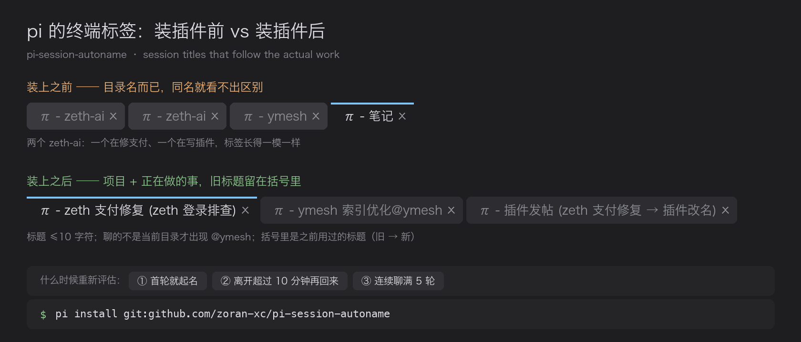

# pi-session-autoname



[](https://github.com/zoran-xc/pi-session-autoname/actions/workflows/test.yml)
[](LICENSE)


给 [pi](https://pi.dev) 用的会话标题管理：标题跟着你实际在做的事走。一个单文件 pi 包，零依赖。

[English](README.md) · [中文](README.zh-CN.md)

## 问题

pi 本来就能命名会话（`/name`、`--name`、`/resume` 里 <kbd>Ctrl</kbd>+<kbd>R</kbd>），也会把这个名字同步到终端窗口标题。但它**不会让这个名字一直是真的**：你把它命名成「支付修复」，三个话题之后它还叫「支付修复」；开了四个终端，标签栏里就是四个 `π - zeth-ai`。现实中没人会记得手动改名，于是标签就废了。

## 安装

```bash
pi install git:github.com/zoran-xc/pi-session-autoname@v0.2.1
```

本地开发可以指向检出目录：

```bash
pi install /path/to/pi-session-autoname
```

重启 pi 生效。运行期数据在 `~/.pi/agent/session-autoname/`，**不在包目录里**，所以 `pi update` 不会冲掉你的配置：

| 文件 | 作用 |
| --- | --- |
| `config.json` | 配置。每次使用都热读，改完不用重启 |
| `naming-rules.md` | 你的命名偏好，写成提示词（见下） |
| `autoname.log` | 每次改名、渲染出的终端标题、报错（超过 256 KB 自动截断） |

## 它做什么

- **第一轮就起名**，之后随实际工作变化持续修正。
- **按节奏重新评估，而不是每轮都打扰模型** —— 见下表。
- **只把对话结论喂给命名模型**：用户消息 + 助手回复。工具调用参数、工具输出、thinking 一律不进请求，请求小、开销低。
- **旧标题挂在括号里**，改名不会丢掉「我之前在干什么」。
- **只有「聊的不是当前目录」时才标 `@项目`**，人在正确目录里就不重复念项目名。
- 标题**硬上限 10 字符**：超长先给模型一次自我压缩的机会，仍超长才硬截断。
- 挡掉占位词垃圾（`未命名`、`none` …）；会话还没有标题时，不信模型回的 `changed=false`。

### 重新评估的节奏

| 时机 | 行为 |
| --- | --- |
| 会话还没有标题 | 第一轮收尾就起名 |
| 离开超过 `idleRenameAfterMs`（默认 10 分钟）才回来 | 这一轮收尾时重新评估 |
| 连续对话 | 每 `updateEveryTurns`（默认 5）轮评估一次 |

空闲时长量的是上一轮结束到这一轮**开始**，所以它反映**你**离开多久，而不是 agent 干了多久。

## 命名偏好是提示词，不是配置枚举

这是它和多数同类插件最不一样的地方。不是给你一个 `nameFormat` 模板加几个类型枚举，而是把整份命名策略交给你写：

```markdown
- 语言与我一致
- 标题 ≤ 10 个字符，砍次要信息但不砍「项目 + 动作」
- 优先级：项目名 > 当前动作 > 上下文
- 聊的不是当前工作区时，把项目短名填进 project 字段
- 话题迁移时跟着迁移，别停在最开始那件事上
- 任务没变就别改名，不要无意义抖动
```

「怎么起名」本来就是人的偏好，不是几个枚举能穷尽的，所以它放在提示词里。改 `~/.pi/agent/session-autoname/naming-rules.md`，下次评估即生效。

## 终端标题模板

会话名保持短，其余信息由模板拼进终端标题（默认 `π - {name}{project} {prev}`）：

| 占位符 | 渲染成 |
| --- | --- |
| `{name}` | 当前标题 |
| `{project}` | **仅当「聊的项目 ≠ 当前工作区」**时渲染 `@项目短名`，否则为空 |
| `{prev}` | 之前用过的标题，如 `(zeth 登录排查 → zeth 支付修复)` |
| `{status}` | 进行中 / 待审核 / 已完成 / 阻塞（默认没用，读起来太吵） |
| `{turns}` | 已聊轮数 |

占位符为空时会自动收拾多余分隔符与空括号，所以 `π - {name} {status}` 不会退化成 `π - foo - `。把 `titleTemplate` 设为 `""` 就完全不接管终端标题。

> **VS Code**：集成终端默认不显示程序设的标题。把 `"terminal.integrated.tabs.title"` 设为 `${sequence}`。
> 不要在前面接 `${process}` —— 那会给每个标签多加一段没用的 `node - `。

## 配置

`~/.pi/agent/session-autoname/config.json`，热读，不用重启：

| 键 | 默认 | 说明 |
| --- | --- | --- |
| `enabled` | `true` | 总开关 |
| `model` | `""` | 命名模型；空 = 用当前会话的模型。便宜的模型够用 |
| `maxChars` | `10` | 标题字符上限（每个字符都算 1） |
| `rulesFile` | `naming-rules.md` | 你的命名策略 |
| `extraInstructions` | `""` | 追加到系统提示 |
| `updateEveryTurns` | `5` | 连续对话里的重评估周期 |
| `idleRenameAfterMs` | `600000` | 离开这么久再回来就重新评估 |
| `minMsBetweenUpdates` | `30000` | 两次命名请求的最小间隔 |
| `includeAssistant` | `true` | 是否也把助手回复喂给模型 |
| `perMessageChars` / `maxDigestChars` / `maxMessages` | `1200` / `6000` / `30` | 摘要体积限制 |
| `titleTemplate` | `π - {name}{project} {prev}` | 终端标题模板 |
| `prevTitleCount` | `2` | `{prev}` 显示几个旧标题 |
| `includeGitBranch` | `true` | 把当前 git 分支放进模型上下文 |
| `skipWhenNoUI` | `true` | `pi -p` 下不自动命名（省一次请求） |
| `debug` | `false` | 界面提示 + 全量追踪日志 |

### 命令

```
/autoname            # 当前标题、状态、节奏、历史标题
/autoname now        # 立刻重新评估
/autoname on|off     # 本会话开关
/autoname config     # 打印配置路径
/autoname rules      # 打印命名规则路径
```

注意：手动 `/name` **不会**关掉扩展 —— 你起的名字会被记进历史、显示在括号里。想接管就用 `/autoname off`。

## 与同类插件的对比

npm 上至少有十个 pi 包在做类似的事，以下是最接近的几个，事实取自各自 README：

| 包 | 何时改名 | 可配置程度 | 终端标题 |
| --- | --- | --- | --- |
| `pi-session-name` | 只在首轮、只用第一条输入，之后冻结 | — | ✅ busy/idle 前缀 |
| `@nicknisi/pi-session-name` | 首个 `agent_settled` | 启发式或一次性 LLM | ✅ |
| `@d3ara1n/pi-session-namer` | 首轮（side agent，多 0.5–1 秒） | 设计上零配置 | — |
| `pi-session-namer` | 首轮 + 每 4 轮 | 格式模板 + 类型枚举 + 语言 | — |
| `pi-autoname` | 首轮 + 10 分钟冷却 | 模型 / 冷却 / 是否尊重手动命名 | — |
| `@oipsanthony/pi-session-title` | 首轮 + 每 4 个用户轮次 | 模型 / 周期 / `{title}{cwd}` 模板 | ✅ 模板化 |
| **pi-session-autoname** | 首轮 + **空闲 >10 分钟回来** + 每 5 轮 | **命名策略就是一份 markdown 提示词** | ✅ `{name}{project}{prev}` |

说实话的部分：周期性重评估**不是**本插件独有 —— `pi-session-namer`、`pi-autoname`、`@oipsanthony/pi-session-title` 都会周期重评。真正的区别在**触发信号**（这里量的是**你**离开多久）、**留痕**（旧标题留在标签上）、以及**能改到什么程度**（提示词而不是旋钮）。它**没有** tmux / Herdr 集成、没有图形化配置，而且默认要求你写一份命名策略，不是开箱零配置。

## 工作原理

1. `session_start` 读会话，从自己的托管标记里恢复状态与历史标题，并把已存在的名字记为旧标题。
2. 到节奏就构建摘要（只含 user / assistant 文本），问模型要 `{"title","status","project","changed"}`。
3. `changed=false` 只更新内部状态，不动会话名。
4. `pi.setSessionName()` 让 pi 刷新终端标题；扩展再用渲染后的模板覆盖一次（同步调用，后写的赢）。
5. 被中断或出错的一轮（`stopReason` 为 `aborted` / `error`）在代码里强制标「待审核」—— 这部分不交给模型。

## 坑

- **别在扩展里调 `pi.exec`**：会让 `pi -p` 无法退出（在 pi 0.85.1 上实测）。本扩展直接读 `.git/HEAD`，零子进程。
- 命名请求是**独立请求**，不计入 pi 的会话成本统计。用便宜模型 + 限制摘要体积来控制开销。
- `pi -p` 看着像卡死时，先看会话 `.jsonl`：多半是 agent 在连续跑工具，不是死锁。

## 开发

```bash
npm test        # 16 个场景、45+ 项断言，全离线（假 pi/ctx/model，不需要 API key，不花钱）
node assets/make-demo.py   # 重新生成 README 图片（需要 pillow + macOS 中文字体）
```

版本历史见 [CHANGELOG.md](CHANGELOG.md)。

## License

MIT
